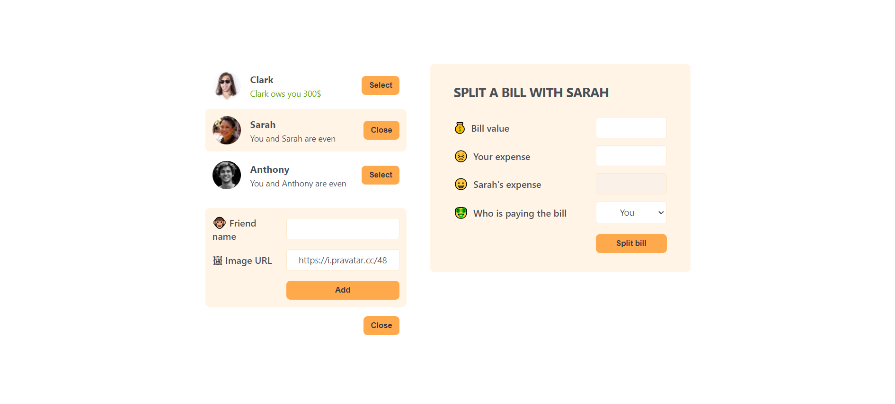

# eatNSlip

This app helps user to do a bill split.

### Preview

## How to Run the Project

1. Clone this repository.
2. Install dependencies by running `npm install`.
3. Start the application using `npm start`.

Enjoy your meal!.
